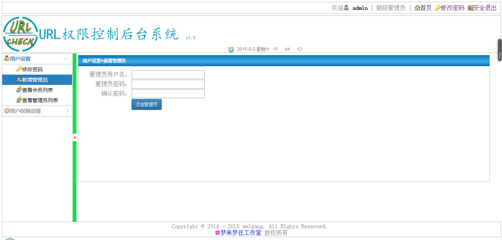

UrlCheck 基于url实现的权限认证系统
=============

###2015-04-17
1.加入log4j到项目中，在gf,admin.do的servlet中有质变的操作加入写日志。 
2.完成登陆界面的设计并实现。 
3.去掉系统中冗余部分代码。【blicent/js】 

###2015-04-18
1.使用西部数码java虚拟主机。 
2.添加remote_db.properties文件。 

###2015-04-20
1.测试西部数码java虚拟主机失败，远程虚拟主机找不到java class类，程序一走到serlvet就找不到资源。 
2.将数据库连接工具更换成自己编写的数据源与连接池小工具mgds4j. 
3.完成后台首页的top布局。 

###2015-04-22
1.去掉ParamUtil.java类，将其中用到的配置移动到appconfig.properties文件中. 
2.加入版权界面bot.jsp。 

###2015-04-23
1.使用升级后的mgds4j数据源与连接池工具，主要是对控制mgds4j中的日志输出部分。 
2.1在jquery插件库中找到了一个比较适合的手风琴菜单样式，并集成进来到master分支。 
2.2将jquery treeview改造的menu.jsp的版本生成新分支到mgtreeview中。 

###2015-04-24
1.设计top页中的横条，使用logo加系统名字加版本，后跟系统时间。 

###2015-04-25
1.完成后台左边菜单隐藏功能，对后台框架做了基本调整。 
2.修复bug-多个角色的权限覆盖问题。（知识点：java跳出多层循环） 
3.将后台界面加入小图标修饰，小图标资源cus-icons来源于gitoschina的jicon项目。 
4.将系统logo加入到后台登陆界面。 

###2015-04-26
1.完成部分welcome.jsp欢迎页的设计，主要是加入了天气，日历等；系统介绍的话之后再完善。 

2.修复后台主页缩放后main中的内容无法正常显示问题
<pre>
	function refershMainRight(){
		$("#mainFrame").css("width",(document.body.offsetWidth-210*0.97);//.css("position","absolute");
	}
</pre>

###2015-04-27
1.修复浏览器没全屏时到后台主页，midden.jsp中的main部分无法正常显示的bug。 
2.加入layer弹出层第三方插件，layer.msg信息提示层无问题。 
3.layer.confirm()层，在frameset下使用显示不在最上层，只是在自己超链接所出现的框架部分页中。 
这个是layer贤心没有发现的bug吧，我得邮件告知。

###2015-04-28
1.layer.confirm()的原理和confirm()原理不一样，所以两者我还没有找到可以替换的方式。[故还是保持confirm] 

###2015-05-01
1.经过多方层插件的测试，得出一个结论。层confirm不适用于frameset框架模式下。这次不想对布局做太多改动来适应这一功能，就默认使用 
系统的confirm来提示。期间考虑过showBo,yxsss(易U)等。

###2015-05-02
1.完成welcome.jsp页中的致词。

2.将自己的小图标添加到bot.jsp中。

3.使用bt3中按钮样式来美化界面中的按钮和部分超链接。

4.修复手风琴菜单选中后li背景色不停留bug.

###升级系统为v2.0并生成v2.0分支

###2015-05-14
1.添加界面提示语，让系统更加人性化。 
( 
a,变更用户角色，变更角色权限都需要该用户重新登录后方生效。 
b,如果welcome页，在没有联网的情况下，天气是无法正常显示的。 
) 
2.删除角色时，建立事务，同时将拥有该角色的用户的have字段设置为0，并且在t_role表中删除掉该角色。 
3.将天气的webservice 的url路径配置到appconfig.properties文件中，这样可以灵活控制。 
4.将servlet中的方法加上日志信息输出。 

###2015-05-26
1.修复权限匹配参数个数不一致的bug漏洞。

###2015-5-28
1.完成url权限匹配解决方案框架的jar包导出。 
2.上传到github上，使用github pages技术来展示该项目。 
3.更新数据库备份文件urlcheck20150528.sql。

###2015-05-31
1.完成urlcheckjar项目的测试，并导入该框架的jar包后，项目正常运行。

